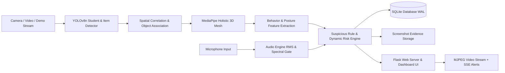

# AI Exam Hall Monitoring System (Holistic Detection)

An intelligent, edge-first automated exam proctoring and surveillance system powered by YOLOv8 object detection, MediaPipe Holistic mesh tracking, acoustic anomaly surveillance, stateful risk assessment, and an interactive Flask web dashboard.

---

## 1. Project Title & Overview

The **AI Exam Hall Monitoring System** is an automated invigilation system designed to preserve academic integrity during written, digital, and remote examinations. Unlike conventional cloud-based proctoring software that streams sensitive biometric data across the internet, this platform runs **entirely on-premises**, analyzing live video and acoustic streams in real time on local hardware.

### Key Capabilities
- **Multi-Student Detection & Spatial Tracking**: Detects candidates in the examination hall, assigns persistent tracking IDs, and correlates physical objects directly to candidate regions of interest.
- **Unauthorized Item Surveillance**: Instantly flags forbidden physical materials—including cell phones, books/notebooks, and laptops/tablets.
- **Holistic Biometric Mesh Analysis**: Computes 3D head yaw and pitch (looking left, right, up, down), hand-to-face proximity (whispering or concealment), and posture anomalies (abnormal leaning, standing).
- **Acoustic Surveillance**: Measures real-time ambient noise energy (RMS), detects vocal utterances or whispered conversations, and dynamically adapts to classroom background noise.
- **Stateful Absence Detection**: Identifies when a previously established candidate leaves their workstation or disappears from the camera frame.
- **Dynamic Risk Scoring & Alert Classification**: Calculates calibrated risk scores (0–100%) with automated decay during normal behavior, categorized by severity (`CRITICAL`, `HIGH`, `MEDIUM`, `LOW`).
- **Web-Based Proctor Dashboard**: Features a live MJPEG stream with overlaid landmark skeletons, real-time Server-Sent Events (SSE) alert telemetry, incident review actions, CSV exports, and printable HTML/PDF audit certificates.
- **Zero Cloud Footprint**: Completely self-contained; zero network calls or telemetry transmitted externally.

---

## 2. System Architecture & Pipeline

The system employs a multi-threaded architecture coordinating video capture, deep learning inference, state tracking, and web presentation:



For complete technical specifications and sequence diagrams, refer to [docs/architecture.md](file:///home/shyam/Desktop/holistic-detection/docs/architecture.md).

---

## 3. Hardware & Software Prerequisites

### Software Requirements
- **Operating System**: Linux (Ubuntu 20.04+, Debian 11+, Fedora), macOS 12+, or Windows 10/11 (64-bit).
- **Python**: Version `3.12.3` (tested and recommended) or `3.10+`.
- **Key Dependencies**:
  - `opencv-python==4.11.0.86`
  - `mediapipe==0.10.21`
  - `numpy==1.26.4` (Strict constraint: NumPy < 2.0 required for MediaPipe C++ bindings)
  - `ultralytics==8.4.149`
  - `flask==3.1.3`
  - `pytest==9.1.1`

### Hardware Recommendations
| Tier | Processor | Memory | Video Input | Target Performance |
| :--- | :--- | :--- | :--- | :--- |
| **Minimum** | Dual-core x86_64 or ARM64 (Intel Core i3 / M1) | 4 GB RAM | USB Webcam or Pre-recorded Video | 10–15 FPS (Single Student) |
| **Recommended** | Quad-core x86_64 (Intel Core i5/i7, AMD Ryzen 5) | 8 GB RAM | 720p 30FPS Webcam | 20–25 FPS (Multi-Student) |
| **Production** | 8-core CPU or NVIDIA GPU (CUDA 11.8 / 12.X) | 16 GB RAM | HD Exam Hall RTSP/IP Camera | 30+ FPS Real-Time |

---

## 4. Installation & Environment Setup

### Step 1: Clone Repository
```bash
git clone https://github.com/manojkumar-M17/holistic-detection.git
cd holistic-detection
```

### Step 2: Create & Activate Virtual Environment
```bash
python3 -m venv .venv
source .venv/bin/activate
```

### Step 3: Install Required Dependencies
```bash
python -m pip install --upgrade pip
python -m pip install -r requirements.txt
```

### Step 4: Verify Environment Integrity
```bash
python -m pip check
```
*(Expected output: `No broken requirements found.`)*

### Step 5: YOLOv8 Weights Verification
The YOLOv8 nano model weights (`weights/yolov8n.pt`) are downloaded automatically upon first execution. If running in an air-gapped environment, place `yolov8n.pt` directly into the `weights/` directory.

---

## 5. Quick Start (Standard Camera & Demo Mode)

### Standard Mode (Webcam / Live Hardware)
Activate your virtual environment and start the primary surveillance server:
```bash
source .venv/bin/activate
python main.py
```
Open your web browser at:
```
http://127.0.0.1:5000
```
Stop the server at any time using `Ctrl+C`.

### Deterministic Demo Mode (`--demo`)
For evaluation on headless servers, CI runners, or machines without a physical webcam/GPU:
```bash
python main.py --demo
```
In demo mode, the system runs a deterministic 5-phase simulation cycling through:
1. **Phase 1**: Normal candidate workstation behavior.
2. **Phase 2**: Suspicious head turn anomaly (looking left, yaw > 25°).
3. **Phase 3**: Unauthorized item detection (cell phone correlated with candidate).
4. **Phase 4**: Absence detection (candidate leaves seat; empty workstation).
5. **Phase 5**: Candidate returns to seat; risk score decays back to normal.

### Command-Line Arguments
```
python main.py --help
  --demo            Run in deterministic demo mode with synthetic feed
  --source SOURCE   Camera source (device index e.g. 0, video path, or 'demo')
  --host HOST       Flask server binding host (default: 127.0.0.1)
  --port PORT       Flask server binding port (default: 5000)
```

---

## 6. Real-Time Detection Modules

### 6.1 Multi-Student & Item Tracking (`modules/detection.py`)
Utilizes YOLOv8 nano with non-maximum suppression (NMS) to detect persons and candidate accessories. Spatial correlation (`find_student_objects`) maps prohibited objects directly to the student bounding box using bounding box overlap and relative centroid distance.

### 6.2 MediaPipe Holistic Landmarks (`modules/holistic.py`)
Extracts three-dimensional anatomical keypoints from candidate crops:
- **Face Mesh (468 keypoints)**: Measures yaw and pitch vectors from eye corners, nose tip, and chin.
- **Pose Skeleton (33 keypoints)**: Evaluates bilateral shoulder landmarks (11 and 12) for slope and torso angle.
- **Hand Landmarks (21 points per hand)**: Tracks wrist and digit proximity to facial landmarks.

---

## 7. Dynamic Risk Assessment & Suspicious Scoring Engine

The risk engine (`modules/suspicious_engine.py`) maintains continuous per-student risk scores ranging from $0.0\%$ to $100.0\%$:

$$\text{Risk}_{t} = \max\left(0, \min\left(100, \text{Risk}_{t-1} + \Delta_{\text{triggers}} - \text{Decay}\right)\right)$$

### Incident Classification & Risk Penalties
| Severity | Score Range | Triggers | Default Action |
| :--- | :--- | :--- | :--- |
| **CRITICAL** | $90\% - 100\%$ | Cell phone, Multiple persons / Proxy | Red Alert Banner, Instant Snapshot |
| **HIGH** | $75\% - 89\%$ | Continuous head turn ($> 1.5\text{s}$), Laptop | Orange Warning, Incident Logged |
| **MEDIUM** | $50\% - 74\%$ | Book/Notebook, Prolonged Absence, Leaning | Amber Warning, Snapshot Saved |
| **LOW** | $25\% - 49\%$ | Hand near face, Fleeting gaze shift | Yellow Notice, Telemetry Logged |
| **NORMAL** | $0\% - 24\%$ | Standard examination activity | Routine Frame Decay ($-2.0\%$ / frame) |

### Anti-Flooding Cooldowns (`EVENT_COOLDOWNS`)
To prevent duplicate alerts for continuous behaviors, individual event cooldowns throttle database insertions (e.g., cell phone: 5.0s, multiple persons: 15.0s, head turns: 10.0s, absence: 10.0s).

---

## 8. Audio Surveillance & Whisper Detection

Implemented in `modules/audio_engine.py`:
- **Real-Time Acoustic Ingestion**: Interfaced via `sounddevice` or `pyaudio` at 16 kHz sample rate.
- **Dynamic Noise Floor Calibration**: The first 2.0 seconds of monitoring calibrate the room's ambient noise baseline. The alert threshold dynamically floats at:
  $$\text{Threshold}_{\text{dynamic}} = \max\left(\text{AUDIO\_NOISE\_THRESHOLD}, \text{Baseline} \times 1.5\right)$$
- **Whisper & Conversational Gating**: Evaluates Root Mean Square (RMS) energy and zero-crossing rates to flag whispering or talking while suppressing steady ambient noise like air conditioners.

---

## 9. Absence Detection Architecture & Tracking

The absence detection subsystem ensures candidates remain at their designated workstations:
1. **Candidate Confirmation**: A student is marked *established* after being tracked for at least 5 consecutive frames.
2. **Disappearance Timer**: If an established student disappears from the frame, an absence timer records elapsed duration:
   $$\Delta t_{\text{absence}} = t_{\text{current}} - t_{\text{last\_seen}}$$
3. **Trigger Threshold**: When $\Delta t_{\text{absence}} > \text{ABSENCE\_TIMEOUT\_SECONDS}$ (5.0s default), `STUDENT_ABSENT` alerts trigger.
4. **Safe Overlay Rendering**: When an alert fires with `bbox=None`, a top-frame warning banner is generated instead of attempting bounding box coordinate extraction.
5. **Recovery**: When the candidate returns to their desk, tracking resumes immediately, the absence duration resets, and the risk score decays back to normal.

---

## 10. Flask Web Dashboard & Live Proctoring UI

The proctoring dashboard (`dashboard/app.py`) provides an interactive single-page application:
- **Live Video Feed (`/video_feed`)**: Multi-part MJPEG stream at ~25 FPS with overlaid bounding boxes, facial gaze vectors, pose skeletons, and alert indicators.
- **Real-Time SSE Feed (`/api/stream-events`)**: Server-Sent Events stream pushing incident updates, active student count, risk meters, and audio volume meters every second.
- **Incident Management**: Proctors can review recorded infractions, filter by severity or category, and mark incidents as `CONFIRMED` or `DISMISSED`.
- **Live Sensitivity Adjustment (`/api/config`)**: Proctors can dynamically tune head yaw thresholds, pitch limits, audio sensitivity, and feature toggles on the fly without restarting the server.

---

## 11. Audit Reporting & Evidence Export

### CSV Incident Export (`GET /api/incidents/export`)
Generates an audit-ready CSV file containing incident IDs, student IDs, timestamps, categories, activity descriptions, risk percentages, and review statuses.

### Printable Audit Certificate (`GET /api/report/pdf`)
Generates a formal HTML audit report summarizing:
- Overall Session Integrity Score ($100\% - \text{penalties}$).
- Total incident count grouped by severity (`CRITICAL`, `HIGH`, `MEDIUM`, `LOW`).
- Tabular incident chronological log with high-contrast print styling.
- All user-supplied parameters and incident descriptions are sanitized against HTML/XSS injection.

---

## 12. Offline Validation Framework & Ground-Truth Benchmarking

The system includes a headless validation CLI (`tools/run_validation.py`) for evaluating recorded video sessions against ground-truth annotations:
```bash
python tools/run_validation.py --video path/to/session.mp4 --annotations path/to/ground_truth.json --output validation/results
```
- **Frame-by-Frame Evaluation**: Computes precision, recall, false positive rate (FPR), and mean time to detect (MTTD).
- **Audio Timeline Support**: Supports optional audio metric providers to evaluate multimodal video-plus-audio sessions.
- **Reporting**: Generates JSON summaries under `validation/results/` and Markdown reports under `validation/reports/`.

> [!NOTE]
> Ground-truth validation requires verified human-annotated video sessions. This repository does not claim synthetic accuracy metrics without authentic ground-truth recordings.

---

## 13. Hyperparameter Calibration & Threshold Tuning

Use the automated calibration tool (`tools/tune_validation.py`) to determine optimal sensitivity parameters across validation sessions:
```bash
python tools/tune_validation.py --video path/to/session.mp4 --annotations path/to/ground_truth.json --output validation/tuning
```
This utility sweeps thresholds, computes the resulting F1-score and false positive rates, and generates comparative tuning reports to assist proctors in calibrating systems for specific room configurations.

---

## 14. Comprehensive Configuration Reference

All core parameters are centrally configured in `config/config.py`:

| Parameter | Default | Unit | Description |
| :--- | :--- | :--- | :--- |
| `CAMERA_SOURCE` | `0` | int / str | Camera index (0), video path, or `'demo'` |
| `FRAME_WIDTH` | `640` | px | Processing frame width |
| `FRAME_HEIGHT` | `480` | px | Processing frame height |
| `HEAD_YAW_THRESHOLD` | `25` | deg | Horizontal head rotation threshold |
| `HEAD_PITCH_THRESHOLD` | `15` | deg | Vertical head tilt threshold |
| `SUSPICIOUS_DURATION` | `1.5` | s | Continuous duration required before alert |
| `ABSENCE_TIMEOUT_SECONDS` | `5.0` | s | Elapsed time before absence alert triggers |
| `AUDIO_NOISE_THRESHOLD` | `0.08` | RMS | Base acoustic threshold for speech detection |
| `RISK_DECAY_RATE` | `2.0` | %/frame | Rate of risk score reduction during normal state |
| `FLASK_HOST` | `127.0.0.1` | IP | Web dashboard binding address |
| `FLASK_PORT` | `5000` | Port | Web dashboard HTTP port |

---

## 15. Privacy, Ethics & Regulatory Compliance

This platform is engineered following strict Privacy by Design principles:
1. **Local-Only Processing**: All inference, audio monitoring, and storage take place strictly on the host workstation. No frames or biometric data are transmitted over the cloud.
2. **Encrypted Evidence Vault**: Incident screenshots are stored in local directories and can be cleared after the exam integrity audit concludes.
3. **GDPR / FERPA Compliance**:
   - No permanent biometric face embeddings or identities are stored.
   - All incident databases can be permanently purged via `POST /api/incidents/clear` or deleting `database/exam_monitoring.db`.
4. **Transparent Proctoring**: Candidate screens and exam hall displays clearly notify candidates of automated monitoring status.

---

## 16. Security Hardening & Vulnerability Defenses

- **XSS Sanitization**: User inputs (`exam_name`, `candidate_name`) and database activity records are escaped using Python's standard `html.escape()` prior to report rendering.
- **Path Traversal Protection**: Evidence screenshot serving utilizes Flask's `send_from_directory()` with restricted directory boundaries.
- **Database Concurrency & Locking**: SQLite utilizes Write-Ahead Logging (`PRAGMA journal_mode = WAL;`) and a 10.0-second busy timeout to eliminate `database is locked` race conditions.
- **Production WSGI Deployment**: For campus-wide deployment, wrap `dashboard.app:app` in a production WSGI server such as Gunicorn or uWSGI behind an NGINX TLS reverse proxy.

---

## 17. Automated Testing & Code Quality Matrix

The project maintains an exhaustive test suite covering unit, integration, security, and headless execution boundaries:

```bash
# Execute the full automated test suite
python -m pytest -q

# Run dependency integrity verification
python -m pip check

# Verify byte compilation across all modules
python -m compileall .

# Check git formatting and line endings
git diff --check
```

### Test Coverage Highlights
- `tests/test_absence_detection.py`: Verifies absence accumulation, safe `bbox=None` handling, and risk recovery.
- `tests/test_demo_mode.py`: Validates synthetic frame generation and camera-free simulation.
- `tests/test_security_sanitization.py`: Verifies neutralization of HTML/XSS script injection.
- `tests/test_database.py` & `test_database_manager.py`: Validates SQLite migrations, concurrency, and queries.
- `tests/test_risk_engine.py`: Verifies mathematical risk accumulation, cooldowns, and decay rates.
- `tests/test_validation_runner.py`: Tests offline benchmarking runner and audio metric integration.

---

## 18. Known Limitations & Production Caveats

1. **Extreme Low-Light Conditions**: MediaPipe face mesh degrades under severe underexposure (< 15 lux). Ensure adequate exam hall illumination.
2. **Severe Occlusion**: If a candidate completely covers their face with a book or clothing, gaze estimation cannot resolve landmarks, falling back to hand-near-face or object correlation.
3. **Single Camera Multi-Student Parallax**: When a single wide-angle camera monitors multiple rows of desks, students at the periphery exhibit slight perspective distortion. Placing cameras overhead or per-row is recommended for multi-student setups.
4. **Acoustic Crosstalk**: In dense exam halls, loud external noises (e.g., hallway doors) may elevate the RMS meter. Proctors should adjust `AUDIO_NOISE_THRESHOLD` via the dashboard to match room acoustics.

---

## 19. License, Contributions & Academic Citations

### License
This project is licensed under the **MIT License**. You are free to inspect, modify, and integrate this software in academic, commercial, or institutional environments.

### Academic Citations
If you utilize this architecture or codebase in academic research, please cite:
```bibtex
@misc{kumar2026holisticdetection,
  author = {Manojkumar and DeepMind Antigravity Pair-Programming Team},
  title = {AI Exam Hall Monitoring System: Multi-Modal Edge-First Proctoring with Holistic Biometrics},
  year = {2026},
  publisher = {GitHub},
  journal = {GitHub repository},
  howpublished = {\url{https://github.com/manojkumar-M17/holistic-detection}}
}
```