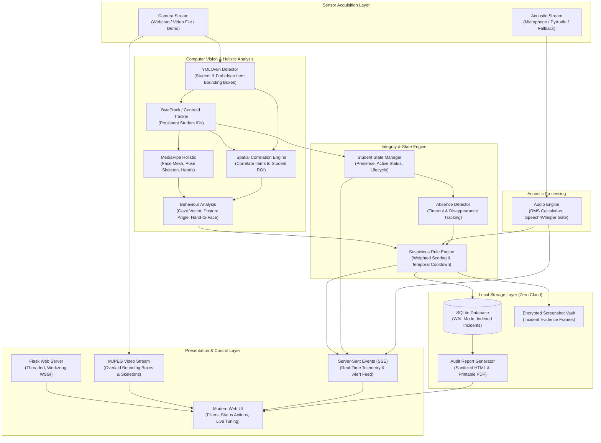
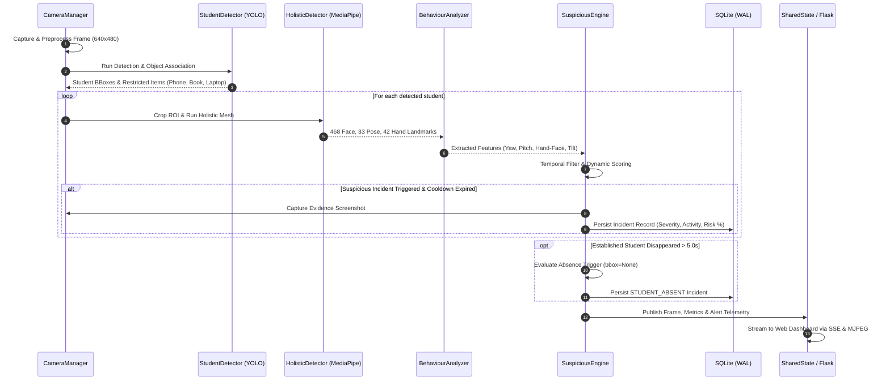
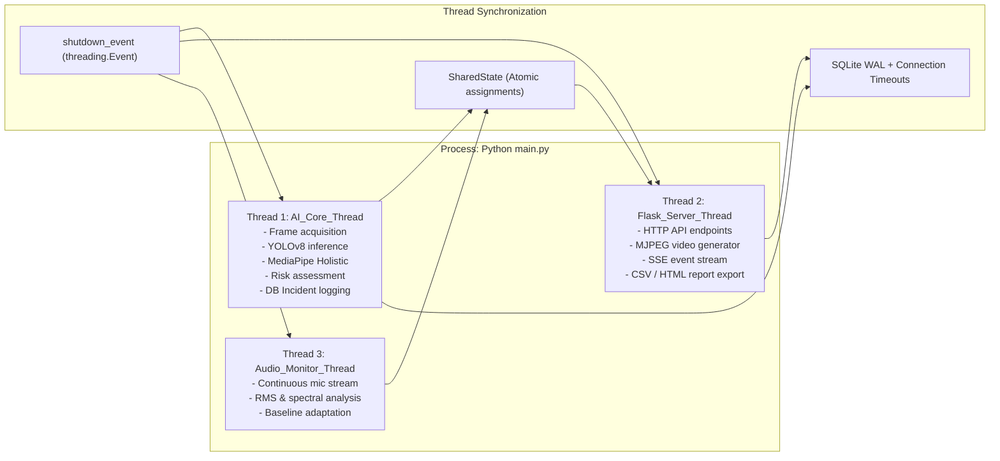

# System Architecture & Technical Specification

The **AI Exam Hall Monitoring System** is an edge-first, multimodal automated proctoring platform designed to monitor exam halls and individual workstations in real time. It combines computer vision, deep-learning-based spatial object tracking, landmark-based gaze and posture analysis, acoustic anomaly surveillance, and stateful risk scoring to detect academic dishonesty while maintaining zero external cloud dependencies.

---

## 1. High-Level Architecture Overview

The system operates across three concurrent subsystems coordinated via thread-safe shared state and a local transactional database:

---

## 2. Core Processing Pipeline

The monitoring loop operates as a background worker thread (`AI_Core_Thread`) executing the following pipeline for every video frame:

---

## 3. Subsystem Breakdown

### 3.1 Camera & Frame Ingestion (`modules/camera.py`)
- **Webcam / USB Feed**: Interfaced via OpenCV `cv2.VideoCapture`.
- **Pre-recorded Video Files**: Supports `.mp4`, `.avi`, `.mov` for deterministic evaluation.
- **Deterministic Synthetic Demo Mode (`source='demo'`)**: Generates calibrated synthetic classroom frames at ~25 FPS with candidate representations, desk geometry, and simulation banners.
- **Resilience**: Auto-reconnects if camera hardware disconnects; falls back gracefully if frame capture fails.

### 3.2 Student & Restricted Object Detection (`modules/detection.py`)
- **Model**: YOLOv8n (Ultralytics nano architecture).
- **Target Classes**:
  - `0`: Person (Students in exam hall)
  - `67`: Cell Phone (High-risk cheating device)
  - `73`: Book / Notebook (Unauthorized reference material)
  - `63`: Laptop / Screen (Secondary electronic screen)
- **Spatial Correlation**: Bounding boxes of forbidden objects are spatially intersected with student bounding boxes using IoU and relative centroid proximity (`find_student_objects`).

### 3.3 Facial Landmark & Pose Analysis (`modules/holistic.py`, `modules/behaviour.py`)
- **MediaPipe Holistic**:
  - **468 Face Mesh Landmarks**: Computes 3D head yaw (left/right turn) and pitch (looking down at notes or up at ceiling) using eye corners, nose tip, and chin landmarks.
  - **33 Body Pose Landmarks**: Tracks shoulder slope (`shoulder_tilt`) for abnormal leaning, and hip/shoulder ratio for standing up.
  - **42 Hand Landmarks**: Measures Euclidean distance between wrist/finger tips and facial landmarks to detect hand-to-face concealment or whispering.

### 3.4 Acoustic Surveillance (`modules/audio_engine.py`)
- **Capture Backends**: Hardware capture via `sounddevice` or `pyaudio`, with automated fallback to simulated baseline noise if audio libraries are unavailable.
- **RMS Volume & Speech Gating**: Computes Root Mean Square (RMS) energy and zero-crossing frequency in decibels (dB).
- **Adaptive Calibration**: Measures ambient noise baseline during initial 2.0 seconds to automatically adjust trigger threshold relative to room acoustics.

### 3.5 Absence Detection Engine (`modules/suspicious_engine.py`, `main.py`)
- **Lifecycle Tracking**: `established_students` tracks students confirmed across at least 5 frames.
- **Absence Timeout**: When an established student is absent from subsequent frames for $> \text{ABSENCE\_TIMEOUT\_SECONDS}$ (5.0s default), `is_absent=True` is triggered.
- **Safe Coordinate Handling**: If `bbox is None`, screenshot alert rendering applies an edge-to-edge warning banner across the frame header without coordinate unpacking errors.
- **State Recovery**: When the student re-enters the frame, the absence duration timer resets and risk score decays gracefully at `RISK_DECAY_RATE` (2.0% per frame) back to zero.

### 3.6 Risk Assessment & Rule Engine (`modules/suspicious_engine.py`, `modules/rule_engine.py`)
- **Multi-Level Severity**:
  - `CRITICAL` ($\ge 90\%$): Cell phone detection, multiple persons / proxy.
  - `HIGH` ($\ge 75\%$): Persistent head turns, laptops, prolonged absence.
  - `MEDIUM` ($\ge 50\%$): Whispering, books, abnormal leaning.
  - `LOW` ($\ge 25\%$): Fleeting gaze shifts, brief hand-near-face.
  - `NORMAL` ($< 25\%$): Standard examination behavior.
- **Temporal Event Cooldowns**: Independent cooldowns per incident type (`EVENT_COOLDOWNS`) prevent flooding the database while an anomalous behavior persists.

### 3.7 Local Persistence & Reporting (`database/db_manager.py`, `modules/report_generator.py`)
- **SQLite Database with WAL**: Configured with `PRAGMA journal_mode = WAL;` and a 10.0s connection timeout for safe concurrent reads from Flask and writes from the detection thread.
- **Indexes**: Indexes on `student_id`, `timestamp`, `severity`, and `status` ensure $O(\log n)$ filter lookups.
- **HTML/PDF Audit Reports**: Generates formal proctoring audit summaries with integrity scores and incident breakdown. All user parameters (`exam_name`, `candidate_name`) and DB fields are sanitized via `html.escape()` to prevent XSS injection.

---

## 4. Threading & Concurrency Model

---

## 5. Security & Privacy Guarantees

1. **Local-Only Processing**: All video, audio, and database operations run entirely on the local machine (`127.0.0.1`). Zero data is transmitted to external servers or cloud APIs.
2. **Deterministic Data Deletion**: All logs and database tables can be wiped instantly via the dashboard API (`POST /api/incidents/clear`) or manual deletion of `database/exam_monitoring.db`.
3. **No Unencrypted Remote Transmission**: In production deployment behind an institutional gateway, Flask should be placed behind a reverse proxy (e.g. NGINX with TLS/HTTPS).
4. **Input Sanitization**: All reporting components apply HTML entity escaping to eliminate stored and reflected XSS vulnerabilities.

